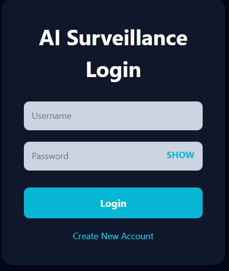
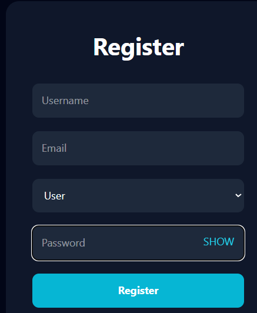
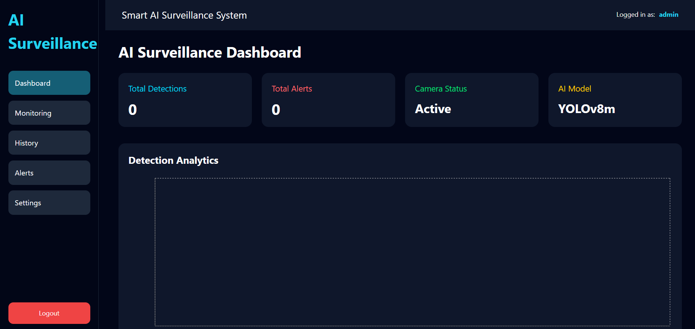
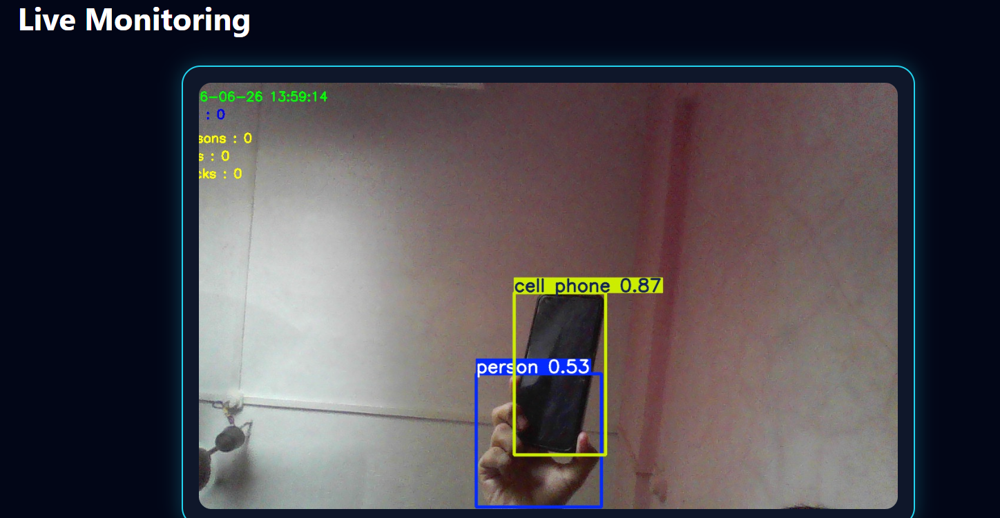
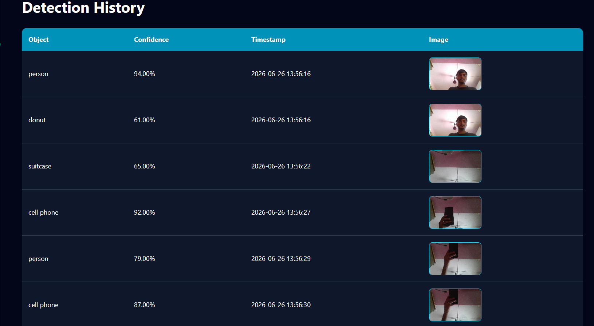
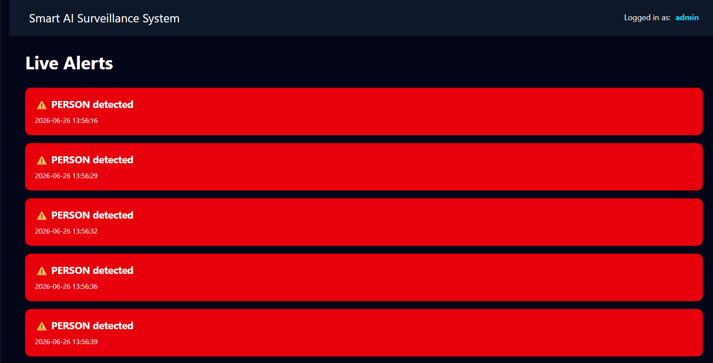
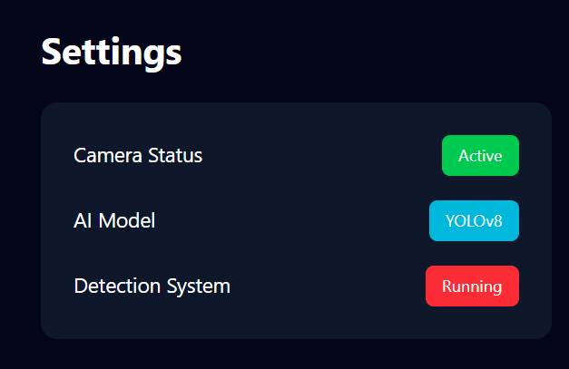

# 🚁 AI Drone Surveillance System

An AI-powered Drone Surveillance System that performs real-time object detection, live video monitoring, alert generation, and event history management using YOLOv8, Flask, React, and SQLite.

## 📌 Features

- 🎥 Live camera/video stream
- 🤖 Real-time object detection using YOLOv8
- 🚨 Automatic alert generation
- 📊 Detection history with timestamps
- 📷 Screenshot capture
- 🔐 User Authentication (Login/Register)
- ⚙️ Settings management
- 📱 Responsive React Dashboard
- 💾 SQLite database for storing alerts and history

---

## 🛠 Tech Stack

### Frontend
- React.js
- Vite
- React Router
- Axios
- CSS

### Backend
- Flask
- Flask Blueprint
- OpenCV
- Ultralytics YOLOv8
- SQLite
- Flask-CORS

### AI Model
- YOLOv8 (Ultralytics)

---

## 📂 Project Structure

```
Drone-Surveillance-System/
│
├── frontend/
│   ├── public/
│   ├── src/
│   ├── package.json
│   └── ...
│
├── backend/
│   ├── models/
│   ├── routes/
│   ├── utils/
│   ├── app.py
│   ├── requirements.txt
│   └── ...
│
└── README.md
```

---

## 🚀 Installation

### 1. Clone Repository

```bash
git clone https://github.com/yourusername/Drone-Surveillance-System.git

cd Drone-Surveillance-System
```

---

## Backend Setup

```bash
cd backend

python -m venv venv

# Windows
venv\Scripts\activate

# Linux/Mac
source venv/bin/activate

pip install -r requirements.txt
```

Download YOLO model automatically:

```bash
python download_model.py
```

Run Flask Server

```bash
python app.py
```

Server runs on

```
http://127.0.0.1:5000
```

---

## Frontend Setup

```bash
cd frontend

npm install

npm run dev
```

Frontend runs on

```
http://localhost:5173
```

---

## Screenshots

## 📸 Application Screenshots

### 🔐 Login Page
Secure authentication for users to access the surveillance dashboard.



---

### 📝 Registration Page
Create a new account with role-based user registration.



---

### 📊 Dashboard
Displays real-time surveillance statistics, camera status, AI model information, and detection analytics.



---

### 🎥 Live Monitoring
Monitor the live camera feed with real-time YOLOv8 object detection and automatic alert generation.



---

### 📜 Detection History
View previously detected objects along with confidence scores, timestamps, and captured images.



---

### 🚨 Live Alerts
Instant notifications whenever a person or configured object is detected by the surveillance system.



---

### ⚙️ System Settings
Displays the current system status, AI model, camera status, and detection service information.



---

## Future Enhancements

- Email Notifications
- SMS Alerts
- Drone GPS Tracking
- Multi-camera Support
- Cloud Storage
- Face Recognition
- Person Tracking (ByteTrack/DeepSORT)
- Mobile Application

---

## Author

**Sanket Kolhe**

B.Tech Computer Engineering

MIT Academy of Engineering, Pune

LinkedIn:  https://www.linkedin.com/in/sanket-kolhe-b2683525b

GitHub: https://github.com/SanketKolhe2005

---

## License

This project is developed for educational and research purposes.
